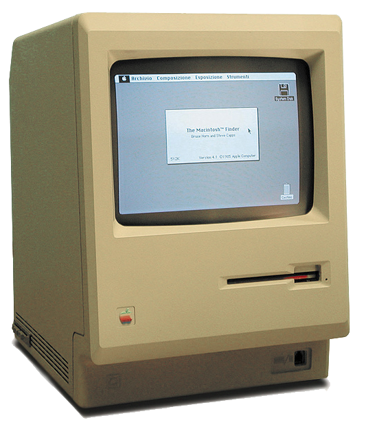

# Pythonプログラマが持つべき心構え

Python で次のコードを実行するとどうなるでしょう？


```python
 import this
```


面白いことに次の "The Zen of Python"  という文章が出力されます。


```python
 >>> import this
 The Zen of Python, by Tim Peters

 Beautiful is better than ugly.
 Explicit is better than implicit.
 Simple is better than complex.
 Complex is better than complicated.
 Flat is better than nested.
 Sparse is better than dense.
 Readability counts.
 Special cases aren't special enough to break the rules.
 Although practicality beats purity.
 Errors should never pass silently.
 Unless explicitly silenced.
 In the face of ambiguity, refuse the temptation to guess.
 There should be one-- and preferably only one --obvious way to do it.
 Although that way may not be obvious at first unless you're Dutch.
 Now is better than never.
 Although never is often better than *right* now.
 If the implementation is hard to explain, it's a bad idea.
 If the implementation is easy to explain, it may be a good idea.
 Namespaces are one honking great idea -- let's do more of those!
 >>>
```

これは、1999年にPythonのメーリングリストで、
Tim Peters氏が「Pythonらしさとはなにか？」と問われて
[投稿した記事](https://mail.python.org/pipermail/python-list/1999-June/001951.html)
がもとになっていて、
この実装は2004年に
[PEP20 - The Zen of Pytho](https://www.python.org/dev/peps/pep-0020/)
として提案されたものです

Perlの生みの親である Larry Wall 氏は、
"There's More Than One Way To Do It."（やり方は一つじゃない）
という思想を持っていて、それが Perl の言語設計に色濃く反映されています。
これに対して、
Pythonでは "There should be one―and preferably only one―obvious way to do it"（誰が見ても明らかな、たったひとつのやり方があるはずだ）
という思想が言語設計の中心にあります。


```
 The Zen of Python, by Tim Peters

 Beautiful is better than ugly.
 醜いより美しいほうがいい。

 Explicit is better than implicit.
 暗示するより明示するほうがいい。

 Simple is better than complex.
 複雑であるよりは平易であるほうがいい。

 Complex is better than complicated.
 それでも、込み入っているよりは複雑であるほうがまし。

 Flat is better than nested.
 ネストは浅いほうがいい。

 Sparse is better than dense.
 密集しているよりは隙間があるほうがいい。

 Readability counts.
 読みやすいことは重要である。

 Special cases aren't special enough to break the rules.
 特殊であることはルールを破る理由にならない。

 Although practicality beats purity.
 しかし、実用性を求めると純粋さが失われることがある。

 Errors should never pass silently.
 エラーは隠すな、無視するな。

 Unless explicitly silenced.
 ただし、わざと隠されているのなら見逃せ。

 In the face of ambiguity, refuse the temptation to guess.
 曖昧なものに出逢ったら、その意味を適当に推測してはいけない。

 There should be one-- and preferably only one --obvious way to do it.
 誰が見ても明らかな、たったひとつのやり方があるはずだ。

 Although that way may not be obvious at first unless you're Dutch.
 そのやり方は一目見ただけではわかりにくいかもしれない。オランダ人にだけわかりやすいなんてこともあるかもしれない。

 Now is better than never.
 ずっとやらないでいるよりは、今やった方がよい。

 Although never is often better than *right* now.
 でも、今「すぐ」にやるよりはやらないほうがマシなことも多い。

 If the implementation is hard to explain, it's a bad idea.
 コードの内容を説明するのが難しいのなら、それは悪い実装である。

 If the implementation is easy to explain, it may be a good idea.
 コードの内容を容易に説明できるのなら、おそらくそれはよい実装である。

 Namespaces are one honking great idea -- let's do more of those!
 名前空間は優れたアイデアのひとつだ、積極的に利用すべきである。
```


この素敵な文章を表示する `this` モジュールは、
Pythonのソースコード(`LIB/this.py`)では次のように実装されています。

```python
 ｓ = """Gur Mra bs Clguba, ol Gvz Crgref

 Ornhgvshy vf orggre guna htyl.
 Rkcyvpvg vf orggre guna vzcyvpvg.
 Fvzcyr vf orggre guna pbzcyrk.
 Pbzcyrk vf orggre guna pbzcyvpngrq.
 Syng vf orggre guna arfgrq.
 Fcnefr vf orggre guna qrafr.
 Ernqnovyvgl pbhagf.
 Fcrpvny pnfrf nera'g fcrpvny rabhtu gb oernx gur ehyrf.
 Nygubhtu cenpgvpnyvgl orngf chevgl.
 Reebef fubhyq arire cnff fvyragyl.
 Hayrff rkcyvpvgyl fvyraprq.
 Va gur snpr bs nzovthvgl, ershfr gur grzcgngvba gb thrff.
 Gurer fubhyq or bar-- naq cersrenoyl bayl bar --boivbhf jnl gb qb vg.
 Nygubhtu gung jnl znl abg or boivbhf ng svefg hayrff lbh'er Qhgpu.
 Abj vf orggre guna arire.
 Nygubhtu arire vf bsgra orggre guna *evtug* abj.
 Vs gur vzcyrzragngvba vf uneq gb rkcynva, vg'f n onq vqrn.
 Vs gur vzcyrzragngvba vf rnfl gb rkcynva, vg znl or n tbbq vqrn.
 Anzrfcnprf ner bar ubaxvat terng vqrn -- yrg'f qb zber bs gubfr!"""

 d = {}
 for c in (65, 97):
     for i in range(26):
         d[chr(i+c)] = chr((i+13) % 26 + c)

 print("".join([d.get(c, c) for c in s]))
```

ここで定義されている文字列 `s` は、`rot13` と呼ばれる単換字式暗号で、
アルファベットを一文字毎に13文字後のアルファベットに
置き換えたものになっています。

このコードは次のように書くこともできますが、
Easter Egg(コンピュータ関連用語では、本来の目的や機能には無関係に実装されたコードや画像のこと)としてあえてアルゴリズムをコードしています。

```python
 import codecs
 print(codecs.decode(this.s,'rot-13'))
```

また、`There should be one-- and preferably only one --obvious way to do it.`には、別の意味があります。
C/C++言語では１を減算するときに、`--val` や `val--` のように、
２つの表記方法を許していますが、
このことを戒めるメッセージがこの文章の中に例として隠されています。

それと、
`Although that way may not be obvious at first unless you're Dutch.`
でオランダ人にしかわからないこともあるかもしれないというのは、
Python の開発者 Guido van Rossum 氏がオランダ人であることによります。

Python のちょっとした遊び心と、
Pythonプログラマが大切にしたい心構えについてでした。

以下は、いくつかある Pythonの Easter Eggsです。
時間のあるときに試してみてください。

## 宿題1
Python のREPL で次のコードを入力するとどうなるでしょうか？

> **REPL(Read-Eval-Print Loop)** とは、
> 入力・評価・出力のループのことを言います。
> インタプリタにおいて、ユーザーとインタプリタが
> 対話的にコードを実行できるものとなります。


```python
 import this

 love = this
 this is love
 this is love and this is True
 this is not love
 love is True
 love is False
 love is not True or False
 love is love
```

一見するとポエムのように見えるコードですが、
Pythonコードとして問題なく動作します。

Python では 真値を True, 偽値を False と表現し、bool型に区分されています。
この bool 型は int 型のサブクラスとして定義されています。

```python
 >>> issubclass(bool, int)
 True
```

実際のところ True は 1、False は 0 と同じ値となります。
条件演算 `==` はオブジェクトが**同じ値を持つときに真**となります。
`is` はオブジェクトが**同じものであるときに真**となります。

```python
 >>> True == 1
 True
 >>> False == 0
 True
 >>> True is 1
 False
 >>> False is 0
 False
```

bool型は int型のサブクラスであることから、演算できることになります。

```python
 >>> True + True
 2
 >>> True * 10
 10
 >>> a = True * 10
 >>> a
 10
 >>> a == True
 False
 >>> if a:
 ...    print('True')
 ...
 True
```

Python の if 文は偽値でないものは真値という考え方で、
つまりゼロもしくは要素がないオブジェクト、`None`以外は真として扱われます。
そのため、`if` 文に与える条件式に `a == True` のように
True かどうかを判断させることは良くない場合があります。

## 宿題2
Python のREPL で次のコードを入力するとどうなるでしょうか？
何かの数字に似ていませんか？

```python
 >>> infinity = float('infinity')
 >>> hash(infinity)/100000
 >>> hash(float('-inf'))/-100000
```

## 宿題3
Python で`print()`関数を呼び出さずに `Hello world!` と表示しましょう。

 * ヒント：`__hello__`モジュールをインポートしてみましょう。

## 宿題4
Python のREPL で次のコードを入力するとどうなるでしょうか？

```python
 >>> import antigravity
```

補足説明：
 [XKCD Python 和訳](https://naglly.com/archives/2009/05/xkcd---a-webcomic---python.php)

## 宿題5
Python のREPL で次のコードを入力するとどうなるでしょうか？

```python
 >>> 1 != 2
 >>> from __future__ import barry_as_FLUFL
 >>> 1 != 2
```

補足説明：
* BDFL: Benevolent Dictator For Life (優しい終身独裁者）
		Pythonの開発者 Guido van Rossum氏 のこと
* FLUFL： Friendly Language Uncle For Life (いつもフレンドリーな言語おじさん）
　 flufl関連モジュールを数多く開発提供しているBarry Warsaw氏のこと
* [PEP 401 -- BDFL Retirement](https://www.python.org/dev/peps/pep-0401/)
		引退したGuidoに関連したエイプリルフール

## 宿題6
Python のREPL で次のコードを入力するとどうなるでしょうか？

```python
 >>> import types
 >>> help(types.CodeType)
```

補足説明：
	気弱な人向けではありません（Not for the faint of heart. ）

## 宿題7
次のコマンドを実行してみましょう。

```bash
 $ python -m http.server
```

別のターミナルから次のコマンドを実行してみましょう。

```bash
 $ python -m webbrowser -n http://localhost:8000
```

## 宿題8
Python のREPL で次のコードを入力するとどうなるでしょうか？

```python
 >>> from __future__ import braces
```

補足説明：
`__future__モジュール` には、将来予見可能な強制的に実施されるべき互換性のない
変更が含まれています。 たとえば、Python 2.7で次のようにインポートすると、
Python 3の場合と同様に、`print`文  を 関数`print()`にすることができます。
`from __future__ import print_function`

他の多くのプログラミング言語とは異なり、Pythonはステートメント、関数、および
ループを作成するときに中括弧（`{ }`) を使用しません。
しかし、それらが将来変更される可能性を考えて `__future__` モジュールに
braces(中括弧) を含めています。
その実行結果がウィットに富んでいます。

>余談:
>Apple社が1984年にリリースした Macintosh 128Kとそれに続く Macintosh Plus は、
>ケース内部に開発者たちのサインが刻まれていました。
>これも、Easter Egg と言えるものでしょう。
>
> 
> 


## 参考資料

*  [Python オフィシャルサイト - Python Humor](https://www.python.org/doc/humor/)
*  [Tim Peters 氏のPythonメーリングリストへの投稿記事 The Python Way]( https://mail.python.org/pipermail/python-list/1999-June/001951.html)
*  [PEP20 - The Zen of Python](https://www.python.org/dev/peps/pep-0020/)
*  [Stack Overflow - The Zen of Pythons](https://web.archive.org/web/20140526061824/http://stackoverflow.com/questions/228181/the-zen-of-python)
*  [我々は「Python」に何を求めているのか](https://gumilab.hatenadiary.org/entry/20120229/1330479257)
*  [Wikipedia - rot13](https://ja.wikipedia.org/wiki/ROT13)
*  [Wikipedia - REPL](https://ja.wikipedia.org/wiki/REPL)
*  [Python Osaka - Pythonで開発するなら読んでおくべきPEP一覧](https://scrapbox.io/PythonOsaka/Python%E3%81%A7%E9%96%8B%E7%99%BA%E3%81%99%E3%82%8B%E3%81%AA%E3%82%89%E8%AA%AD%E3%82%93%E3%81%A7%E3%81%8A%E3%81%8F%E3%81%B9%E3%81%8DPEP%E4%B8%80%E8%A6%A7)
